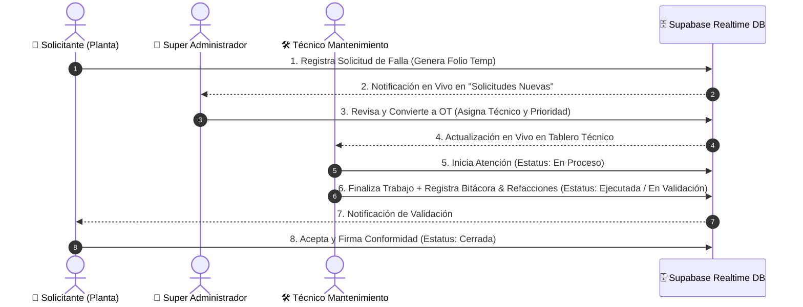

# ⚙️ Towell Smart Maintenance AI (TSM-AI) — CMMS / EAM Industrial

[](https://github.com/towell2026ia/Towell-Smart-Maintenance)
[]()
[]()

**Towell Smart Maintenance AI (TSM-AI)** es una plataforma de **Gestión de Mantenimiento Asistido por Computadora (CMMS)** y **Gestión de Activos de Planta (EAM)** diseñada específicamente para operaciones textiles industriales de alta exigencia. El sistema conecta en tiempo real a Operadores de Planta, Técnicos de Mantenimiento y la Alta Dirección.

---

## 📌 Índice
1. [Arquitectura del Sistema](#-arquitectura-del-sistema)
2. [Matriz de Roles e Interacciones de Usuario](#-matriz-de-roles-e-interacciones-de-usuario)
3. [Flujos Operativos por Usuario](#-flujos-operativos-por-usuario)
4. [Esquema de Base de Datos Relacional (Supabase PostgreSQL)](#-esquema-de-base-de-datos-relacional-supabase-postgresql)
5. [Evolución e Iteraciones del Proyecto](#-evolución-e-iteraciones-del-proyecto)
6. [Instalación y Ejecución Local](#-instalación-y-ejecución-local)

---

## 🏗️ Arquitectura del Sistema

El sistema implementa una arquitectura **SPA (Single Page Application)** moderna, **Offline-First** y **PWA (Progressive Web App)** con sincronización bidireccional en tiempo real.

```
┌──────────────────────────────────────────────────────────────────────────┐
│                             CLIENTE WEB / PWA                            │
│  ┌───────────────────────┐  ┌──────────────────────┐  ┌───────────────┐  │
│  │ 👑 Super Admin        │  │ 🛠️ Técnico / Mantto  │  │ 👷 Solicitan. │  │
│  └───────────┬───────────┘  └──────────┬───────────┘  └───────┬───────┘  │
│              └─────────────────────────┼──────────────────────┘          │
│                                        ▼                                 │
│                         Controlador SPA (`app.js`)                       │
│                           Service Worker `v3.2.0`                        │
└────────────────────────────────────────┬─────────────────────────────────┘
                                         │
                   ┌─────────────────────┴─────────────────────┐
                   │                                           │
                   ▼                                           ▼
┌──────────────────────────────────────┐     ┌─────────────────────────────┐
│    Base de Datos Realtime Supabase   │     │  Caché Local Offline-First  │
│   (PostgreSQL + WebSockets Engine)   │     │        (LocalStorage)       │
└──────────────────────────────────────┘     └─────────────────────────────┘
```

---

## 👥 Matriz de Roles e Interacciones de Usuario

La plataforma segmenta los permisos y la navegación según la jerarquía operativa de la planta:

| Rol de Usuario | Prefijo Folio | Módulos Accesibles | Interacción Principal |
| :--- | :--- | :--- | :--- |
| **Super Administrador** | Todos (`AF`, `CF`, `PF`, `TF`) | Dashboard Ejecutivo, Aprobación de Solicitudes, Control de OT, Calendario, Analítica, Catálogos, Permisos. | Aprueba solicitudes, asigna técnicos, monitorea KPIs de tiempo y supervisa la operación completa de la planta. |
| **Técnico de Mantenimiento** | Según asignación | Tablero Personal de OT, Bitácoras de Trabajo, Registro de Refacciones y Tiempos de Ejecución. | Recibe OTs, cambia estatus (*En proceso -> Ejecutada*), captura horas invertidas y repuestos utilizados. |
| **Solicitante / Operador** | `AF`, `CF`, `PF`, `TF` | Formulario de Solicitudes, Estatus de Solicitudes Propias, Validación de Entrega. | Registra paros o fallas de máquinas y valida el trabajo entregado por el equipo de mantenimiento. |
| **Portal Público** | N/A | Consulta por Folio / Código QR | Permite verificar el estado de una máquina o solicitud de forma rápida sin inicio de sesión. |

---

## 🔄 Flujos Operativos por Usuario



---

## 🗄️ Esquema de Base de Datos Relacional (Supabase PostgreSQL)

El sistema opera sobre una base de datos PostgreSQL alojada en Supabase con sincronización WebSockets en vivo:

### 1. Tabla: `solicitudes_mantenimiento`
* **`id`** *(UUID, PK)*: Identificador único de la solicitud.
* **`folio_temp`** *(VARCHAR)*: Folio temporal por área (*ej: AF00001, CF00002, PF00003, TF00004*).
* **`fecha`** *(TIMESTAMPTZ)*: Fecha y hora de creación.
* **`maquina_id`** *(VARCHAR, FK)*: Clave del equipo reportado.
* **`area`** *(VARCHAR)*: Área de la planta (*PF = Producción, CF = Costura, TF = Tintorería, AF = Planta/Servicios*).
* **`tipo`** *(VARCHAR)*: Correctivo, Preventivo, Formatos Autónomos.
* **`urgencia`** *(VARCHAR)*: Baja, Media, Alta, Crítica.
* **`estatus`** *(VARCHAR)*: Recibida, En revisión, Convertida a OT, Cancelada.

### 2. Tabla: `ordenes_trabajo`
* **`id`** *(UUID, PK)*: Identificador único de la OT.
* **`folio_ot`** / **`cve_ot`** *(VARCHAR)*: Folio oficial de la orden de trabajo.
* **`fecha_creacion`** *(TIMESTAMPTZ)*: Fecha de emisión.
* **`maquina_id`** *(VARCHAR, FK)*: Clave de la máquina asociada.
* **`area`** *(VARCHAR)*: Área de la planta.
* **`tipo`** *(VARCHAR)*: Mantenimiento Correctivo (MC), Preventivo (MP).
* **`prioridad`** *(VARCHAR)*: Urgencia asignada por el administrador.
* **`cve_atendio`** *(VARCHAR, FK)*: Clave o UUID del técnico responsable.
* **`estatus`** *(VARCHAR)*: Asignada, En proceso, En espera, Ejecutada, En validación, Cerrada.
* **`avance`** *(INT)*: Porcentaje de progreso de ejecución (0% - 100%).
* **`fecha_compromiso`** *(TIMESTAMPTZ)*: Fecha objetivo de entrega.

### 3. Tabla: `cat_maquinas`
* **`id`** *(UUID, PK)*: Identificador de registro.
* **`equipo_towell`** *(VARCHAR)*: Clave oficial del equipo (*ej: TOW-TEL205-TEJI*).
* **`nombre_maquina`** *(VARCHAR)*: Nombre descriptivo del activo.
* **`area`** *(VARCHAR)*: Área a la que pertenece la máquina.
* **`criticidad`** *(VARCHAR)*: Nivel de criticidad de paro (A, B, C).

### 4. Tabla: `cat_refacciones`
* **`id`** *(UUID, PK)*: Identificador de repuesto.
* **`cve_refaccion`** *(VARCHAR)*: Código único de parte.
* **`descripcion`** *(VARCHAR)*: Nombre o especificación de la refacción.
* **`stock`** *(INT)*: Existencia actual en almacén.
* **`precio_unitario`** *(NUMERIC)*: Costo en USD/MXN.

### 5. Tabla: `cat_usuarios_roles`
* **`id`** *(UUID, PK)*: Identificador de usuario.
* **`cve_usuario`** *(VARCHAR)*: Nombre de usuario o número de nómina.
* **`nombre`** *(VARCHAR)*: Nombre completo del usuario.
* **`rol`** *(VARCHAR)*: ADMIN, MANTENIMIENTO, SOLICITANTE.
* **`departamento`** *(VARCHAR)*: Departamento asignado.

---

## 📜 Evolución e Iteraciones del Proyecto

### **v1.0.0 - v1.5.0 — Cimientos del CMMS y SPA**
- Diseño inicial del sistema Single Page Application con JavaScript Vanilla y CSS3 puro.
- Formularios de solicitud y tablas de control local en `LocalStorage`.

### **v2.0.0 - v2.5.0 — Integración de Supabase Realtime & Folios Estándar**
- Conexión con PostgreSQL en Supabase en tiempo real.
- Estandarización de folios por área (`AF` = Planta, `CF` = Costura, `PF` = Producción, `TF` = Tintorería).
- Incorporación del **Modal de Auditoría 360°** de Órdenes de Trabajo.

### **v2.8.0 - v3.0.0 — PWA, Optimización de Rendimiento y Reglas CSS**
- Registro de Service Worker PWA con control de versiones de caché.
- Optimización de peticiones en tiempo real (polling pasivo ajustado a 60s con detección de pestaña activa `document.hidden`).
- Reglas estrictas CSS `display: block !important` para garantizar la visibilidad de los paneles.

### **v3.1.0 - v3.2.0 — Reestructuración Definitiva del DOM y Blindaje contra Nulos**
- **Reestructuración del DOM de Paneles Admin**: Corrección del anidamiento de etiquetas `<div>` en el catálogo de bases de datos (`#panel-admin-databases`), garantizando que todos los 37 paneles residan al mismo nivel jerárquico dentro de `#admin-panels-container`.
- **Manejo Dinámico por Clases (`.active-panel`)**: Transición del control de paneles mediante clases CSS estrictas para evitar colapsos visuales.
- **Blindaje contra Registros Incompletos**: Protección en `renderAdminOrdersTable` y `renderAdminRequestsTable` contra fechas nulas (`dueDate`), prioridades faltantes y referencias no definidas.

---

## 💻 Instalación y Ejecución Local

### Prerrequisitos
- **Node.js** (v18.0.0 o superior) instalado en el sistema.

### Pasos de Ejecución
1. **Clonar el repositorio**:
   ```bash
   git clone https://github.com/towell2026ia/Towell-Smart-Maintenance.git
   cd Towell-Smart-Maintenance/app
   ```

2. **Iniciar el Servidor HTTP Local**:
   ```bash
   node scratch/serve_app.js
   ```
   *El servidor iniciará en `http://localhost:8080`.*

3. **Abrir en el Navegador**:
   Navega a `http://localhost:8080` y utiliza las credenciales rápidas de prueba:
   - **Super Administrador**: Clic en *"Acceso Rápido Admin"*
   - **Técnico**: Clic en *"Acceso Rápido Técnico"*
   - **Solicitante**: Clic en *"Acceso Rápido Solicitante"*

---

### 🛡️ Licencia y Propiedad
Este proyecto es software propietario desarrollado para **Towell Smart Maintenance (TSM-AI)**. Todos los derechos reservados.
